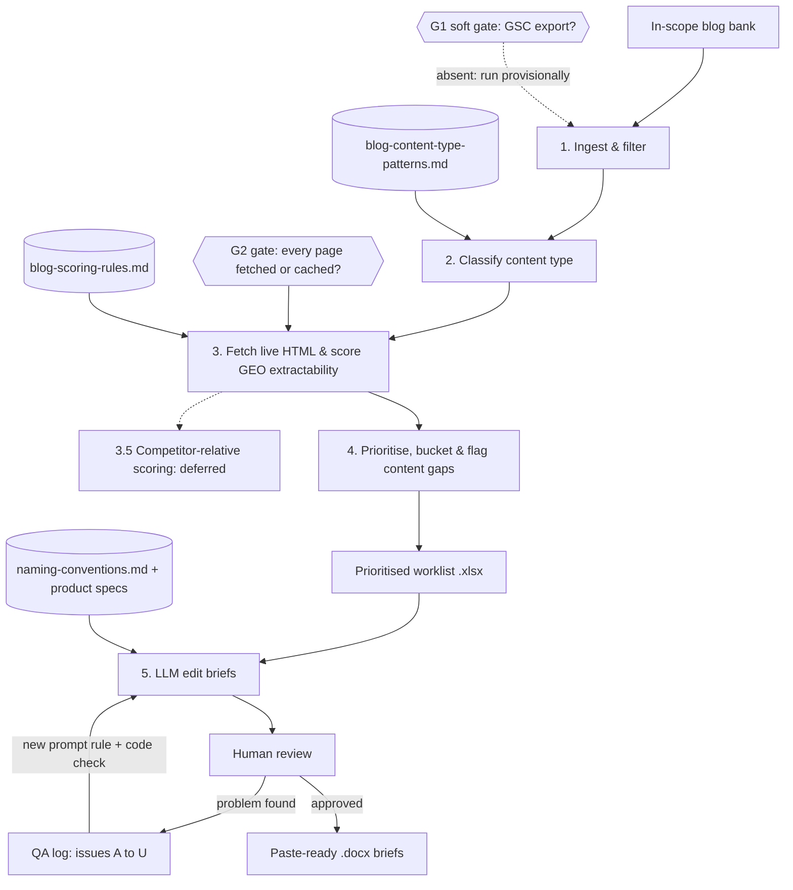
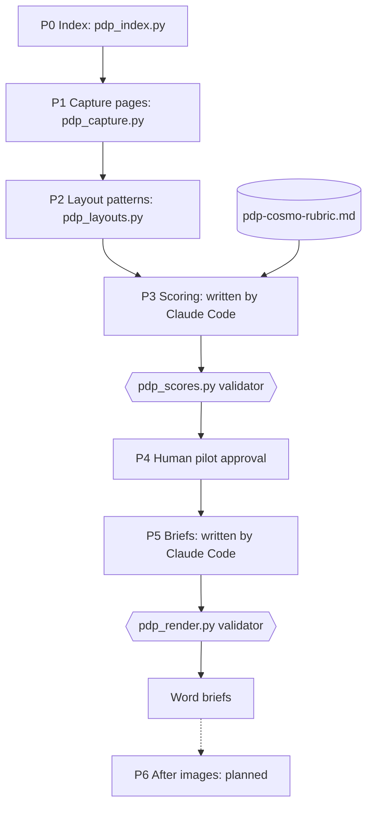

# BFCM GEO Engine

**Two modules that make a brand's content easier for AI search engines to use before Black Friday / Cyber Monday: blog GEO extractability scoring with a prioritised worklist, and PDP COSMO scoring with paste-ready product-page edit briefs.**

Built with Claude Code for a consumer-appliance brand. The client's identity has been anonymized ("Ecommerce" on `ecomusa.example`, with invented product names), and **all data in this repository is synthetic**.

---

## The problem

Shoppers increasingly research purchases through AI answers (ChatGPT, Gemini, AI Overviews) rather than ten blue links. Those systems quote pages that are easy to extract from: a direct answer under a question heading, a clean comparison table, an FAQ with matching schema, concrete numbers. This is **GEO (Generative Engine Optimization)**.

Before the biggest retail weekend of the year, a content team needs to know:

- **Which** of its blog posts matter most for purchase decisions?
- **How extractable** is each one today, and **what exactly** is weak?
- **What should the page say instead**, in copy that can be pasted straight in?

The **blog module** answers all three for a fixed set of in-scope posts (steam irons and handheld steamers). The **PDP module** (below) does the same for product detail pages. The runnable demo covers the blog module; the PDP module ships its code, rubric, prompt and an [example brief](sample_output/pdp-example-brief.md).

---

## Blog module: how it works



| Stage | Script | What it does |
|---|---|---|
| 1. Ingest | `blog_ingest.py` | Joins the blog inventory to the in-scope bank, mapping columns **by header name**. The join must match the bank exactly, or the run stops. |
| 2. Classify | `blog_classify.py` | Tags each post as comparison, buying guide, gift guide, price bracket or informational, using patterns kept in `reference/blog-content-type-patterns.md`. The first four are "decision content", the pages that matter most for purchases. |
| 3. Score | `blog_score.py` | Fetches each page politely (descriptive user-agent, rate limit, cache reused on re-runs) and scores it 0–100 against a fixed rubric: answer-first paragraphs, question headings, comparison tables, FAQ + FAQPage schema, stats, citations, schema completeness, freshness, gift-persona language, and a **penalty for keyword stuffing**. Each page gets its `weakest_criteria`. |
| 4. Prioritise | `blog_prioritize.py` | Ranks decision-content pages worst-first, routes each to a strategy bucket, and flags content types with too few posts as candidate new content (flagged, never auto-created). |
| 5. Edit briefs | `blog_remediate.py` | For priority pages, calls the Anthropic Messages API to write a brief: proposed metadata, an answer-first block, a comparison table, an FAQ, JSON-LD and placement notes. Grounded in the brand's product-spec files and naming conventions, then checked in code before output. |
| Checks | `check_specs.py` | Validates the product-spec files the briefs rely on. |

---

## PDP module: COSMO scoring of product pages

**The problem.** AI shopping and search assistants shortlist products whose pages state the outcome, the use case and the limits in plain words. A page that is only a spec list ("1600 W, 24 g/min") gives them nothing to quote, and a missing filter attribute (weight, tank size) can drop the product from a shortlist entirely. The PDP module scores each product page against six questions (what is it, who is it for / not for, what job does it do, which situation, what can it do and what are the limits, what is the benefit and why), each 0–3, converted to a COSMO score out of 100. It then writes an edit brief whose rewritten copy follows **Outcome + Feature + Use case**.

**What to read:** [`sample_output/pdp-example-brief.md`](sample_output/pdp-example-brief.md), a finished synthetic brief: scorecard, exact before/after copy, a gifting bullet and a question for the client's content editor.



| Stage | Script | What it does |
|---|---|---|
| P0. Index | `pdp_index.py` | Builds the central index (one row per page, grouped into variant groups) from the product-spec files. |
| P1. Capture | `pdp_capture.py` | Drives a browser (Playwright) to save each page's full screenshot and its section text as `sections.json`. Needs a live site. |
| P2. Layouts | `pdp_layouts.py` | Reduces each page to a sequence of section types and groups pages into per-category templates, written to [`reference/pdp-layout-patterns.md`](reference/pdp-layout-patterns.md). |
| P3. Score | Claude Code + `pdp_scores.py` | Claude Code scores each group against [`reference/pdp-cosmo-rubric.md`](reference/pdp-cosmo-rubric.md) with quoted evidence; the script validates and ranks groups. |
| P4. Pilot | (human) | One pilot brief is approved before any batch runs. |
| P5. Brief | Claude Code + `pdp_render.py` | Claude Code writes the edits following [`reference/pdp-prompts/p5-brief.md`](reference/pdp-prompts/p5-brief.md); the script checks them and renders a `.docx`. `pdp_run_p5_batches.sh` runs batches unattended. |
| P6. After images | (planned) | Not built. |

---

## Design decisions worth noticing

**Every stage has an explicit gate, and the gates fail differently on purpose.** G1 is *soft*: without a Search Console export, the run continues and the worklist is clearly marked provisional rather than blocked. G2 is *self-satisfying*: missing pages are fetched and cached, and the run only halts if a page is unrecoverable, naming it. G3 (the API key) only gates Stage 5.

**Behaviour lives in configuration, not code.** Scoring weights, classification patterns and the brand vocabulary sit in `reference/*.md`. Tuning the engine means editing a readable file, not a script.

**A two-strike rule stops automation going in circles.** If a step fails or is rejected twice, the agent stops trying and proposes the cheapest reliable fallback: for a small set, automate the clean majority and hand the ambiguous minority to a human with a dropdown of valid values; for a large set, sample and spot-check, and report the residual error rate.

**The output is held to an editor's standard.** Every LLM brief was reviewed by hand, and each recurring failure became a numbered issue with a rule added to the prompt and, where possible, a check in code. The full log is in [`reference/blog-stage5-prompt-issues.md`](reference/blog-stage5-prompt-issues.md). A few of them:

| Issue | What went wrong | The rule it created |
|---|---|---|
| **B** | Briefs said "weave in…" instead of writing the copy | Every field is finished, paste-ready copy; notes may only say *where*, never *what* |
| **F** | A comparison table listed a product type the brand doesn't sell, making the brand look like it had a gap | Never put a non-brand product type in a table alongside the brand's products |
| **J** | Keyword volume drove optimisation for a product category too new to have search volume | For new-to-market categories, warn loudly and optimise for alignment and vocabulary instead |
| **K** | Meta title and H1 named two product categories while the body and table covered three | Meta + H1, body and table must name the identical category set, or the brief fails loudly |
| **P** | A proposed meta title ran to 76 characters | Max 60 characters, enforced in the prompt **and** in a code check |
| **S** | The intro set a benchmark that a recommended product didn't meet | No summary may state a threshold a recommended product fails |

**The LLM writes, code audits (PDP).** Claude Code writes the scores and the briefs inside the session, with no API call and no API cost. Code then audits the result: every quoted "current" text must appear word-for-word on the captured page, the COSMO score is recomputed in code as round(sum of six scores / 18 x 100) rather than trusted, and an invalid file stops the run.

**Variant groups.** Pages with identical content and identical specs (colourways) are scored once and share one brief listing every URL. If any spec differs, they are separate groups.

**The batch runner knows when to stop.** `pdp_run_p5_batches.sh` halts if a run produces no new briefs (a session limit or an error), if any brief fails the renderer's checks, or if a brief carries a `for_owner` item (a gap in our own data a human must fix). Finished groups are skipped on re-run.

**"COSMO" is the rubric's name.** The rubric is a GEO tool for the brand's own pages; Amazon itself is out of scope.

**Honest about what isn't built.** The Search Console join is specified (G1, striking-distance and low-CTR signals) but not yet implemented, so the worklist runs in provisional mode. Competitor-relative scoring (Stage 3.5) is deferred. Both are listed as future work in `SPEC.md`. In the PDP module, **P6 (before/after images) is planned, not built**, and there is **no runnable PDP demo**: P1 and P6 need a live site, so this repo shows the PDP code, rubric, prompt and an example brief instead.

**Part of a larger system.** Pages that are thin or superseded are routed to a "refresh / consolidate" bucket, the hand-off point to a sister pipeline: [SEO Cannibalization Engine](https://github.com/adamjaimesrey/seo-cannibalization-engine).

---

## Run the demo (blog module only)

Requires Python 3. The PDP module has no runnable demo.

```bash
python3 -m venv .venv
source .venv/bin/activate
pip install -r requirements.txt
bash scripts/run_blog_demo.sh
```

The demo runs Stages 1–4 on synthetic data, fully offline (pages are served from a cache of 8 fake blog posts deliberately varied in quality, so scores range from single digits to the high 90s). It writes the prioritised worklist to `output/blog-worklist.xlsx`.

Stage 5 needs an Anthropic API key (see `.env.example`), so the demo skips it. A finished example brief for one page from the demo worklist is in [`sample_output/blog-example-brief.md`](sample_output/blog-example-brief.md): follow that page from its score, to its rank, to the edits that fix its weakest criteria.

---

## Built with Claude Code

`CLAUDE.md` holds the working rules every session reads first (stage gates, data-handling rules, token discipline, the two-strike rule), and `SPEC.md` is the design contract, written before the code. Each stage was built in plan mode, one step at a time, verified against real data before being trusted, and committed after passing.

---

## Repository structure

```
scripts/          blog_*.py (Stages 1-5), pdp_*.py / pdp_run_p5_batches.sh (P0-P5), run_blog_demo.sh, check_specs.py, leak_check.py
reference/        blog scoring rubric and patterns, PDP COSMO rubric, layout patterns and P5 prompt, controlled vocabulary, QA log
sample_data/      synthetic inputs and cached pages for the blog demo
sample_output/    an example blog Stage 5 brief and an example PDP brief
CLAUDE.md         instructions for Claude Code
SPEC.md           design specification
```

---

## About

Built by Adam Jaimes Rey, SEO and GEO consultant.

---

## Licence

All rights reserved. This repository is shared for review and portfolio purposes only.
